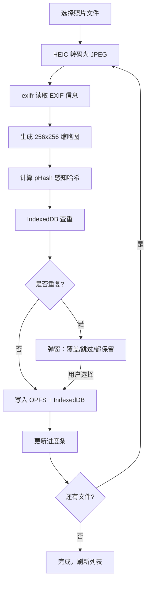

## 1. 产品概述

本地照片管理工具，解决散落在 iCloud、Google Photos、各个硬盘和 U 盘中的照片统一管理问题。核心场景为导入、查重、分类、浏览、搜索，纯前端不上传云端，所有数据存储在本地保护隐私。

- 目标用户：个人用户，有大量本地照片需要统一管理和分类的摄影爱好者或普通用户
- 产品价值：提供一个隐私优先、零部署、纯浏览器端的照片管理解决方案，支持数万张照片的高效管理

## 2. 核心功能

### 2.1 用户角色

本产品为单用户本地应用，无多角色权限区分。

### 2.2 功能模块

1. **照片库页面**：照片列表浏览（网格/瀑布流/时间线三视图）、搜索、批量选择与操作
2. **照片导入模块**：拖拽/点击上传、HEIC 转码、EXIF 读取、缩略图生成、感知哈希查重
3. **大图查看器**：全屏查看、键盘左右翻页、滚轮缩放、旋转纠正
4. **相册管理页面**：相册列表、相册创建/编辑、相册内照片浏览
5. **标签系统**：标签树、标签多选维护、标签重命名与嵌套路径
6. **人物分组页面**：人脸检测结果分组展示、人物命名、分组合并
7. **批量操作中心**：批量加标签、批量移相册、批量删除，Web Worker 异步处理，进度可视化

### 2.3 页面详情

| 页面名称 | 模块名称 | 功能描述 |
|-----------|-------------|---------------------|
| 照片库 | 顶部工具栏 | 搜索框、视图切换（网格/瀑布流/时间线）、导入按钮、批量操作入口 |
| 照片库 | 照片网格视图 | 等大缩略图平铺，支持懒加载，hover 显示复选框和元数据 |
| 照片库 | 瀑布流视图 | 不等高列布局，保持图片原始比例 |
| 照片库 | 时间线视图 | 按拍摄时间倒序分组（年/月/日），左侧时间轴标记 |
| 照片导入 | 拖拽区域 | 页面中央大拖拽区，拖拽时高亮，支持点击选择文件 |
| 照片导入 | 导入进度条 | 显示总进度和单文件进度，HEIC 转码单独提示 |
| 照片导入 | 查重确认弹窗 | 展示重复照片对比（缩略图+元数据），提供覆盖/跳过/都保留选项 |
| 大图查看器 | 主画布 | 居中显示原图，支持滚轮缩放、拖拽平移 |
| 大图查看器 | 控制栏 | 左右翻页按钮、旋转按钮（±90°）、缩放重置、元信息面板 |
| 相册管理 | 相册列表 | 网格展示相册封面、名称、照片数量，支持创建/重命名/删除 |
| 相册管理 | 相册详情 | 展示该相册下所有照片，支持从相册移除 |
| 标签系统 | 标签树侧边栏 | 树形展示所有标签（支持嵌套如 2024/旅行/日本），点击筛选 |
| 标签系统 | 标签编辑器 | 创建新标签、重命名标签（同步所有引用）、删除标签 |
| 人物分组 | 分组网格 | 展示所有人物分组的头像缩略图和名称，未命名显示"未命名 N" |
| 人物分组 | 分组详情 | 展示某人物下所有照片，支持修改姓名和备注 |
| 人物分组 | 分组合并 | 多选分组后合并为一个人物 |
| 批量操作 | 操作面板 | 选择批量操作类型（加标签/移相册/删除），配置参数 |
| 批量操作 | 进度可视化 | 实时进度条、已完成/总数、当前处理文件名 |

## 3. 核心流程

### 3.1 照片导入流程

用户通过拖拽或点击选择照片文件 → 系统逐个处理：HEIC 转 JPEG（如需）→ 读取 EXIF 获取拍摄时间/GPS/设备信息 → 生成 256x256 缩略图（质量 0.7）→ 计算 64 位感知哈希（pHash）→ 查询 IndexedDB 查重 → 若重复则弹窗询问用户处理方式 → 原图写入 OPFS、元数据写入 IndexedDB → 进度条更新 → 完成后刷新照片库。

### 3.2 人脸检测与分组流程

用户在人物页面点击"检测人脸" → Web Worker 后台逐张照片调 face-api.js 检测人脸和特征向量 → 所有特征向量收集完毕后运行 DBSCAN 聚类 → 聚类结果生成 Person 实体（未命名）→ 用户浏览分组并命名/合并 → 结果持久化到 IndexedDB。

## 4. 用户界面设计

### 4.1 设计风格

- **主色调**：深炭灰 `#1a1a1d` 作为背景，营造专业摄影工作室的暗房氛围；点缀色为琥珀金 `#d4a574`，象征老照片的暖调质感
- **辅助色**：浅灰 `#e8e8e8` 用于文字，中灰 `#8a8a8a` 用于次要信息
- **按钮风格**：圆角 6px，次要按钮为半透明玻璃质感，主要操作按钮为琥珀金填充
- **字体**：标题使用 "Playfair Display" 衬线字体（优雅摄影感），正文使用 "Inter" 无衬线字体保证可读性
- **布局风格**：左侧固定侧边栏导航 + 右侧内容区，照片浏览区域使用沉浸式无边框布局
- **图标**：lucide-react 线性图标，统一 20px 尺寸

### 4.2 页面设计概览

| 页面名称 | 模块名称 | UI 元素 |
|-----------|-------------|-------------|
| 照片库 | 整体布局 | 左侧窄侧边栏（导航+标签树）+ 右侧大浏览区，顶部工具栏悬浮 |
| 照片库 | 缩略图卡片 | 暗色圆角卡片，hover 时轻微上浮 + 琥珀金边，底部渐变遮罩显示文件名和时间 |
| 照片导入 | 拖拽区域 | 大面积虚边框区域，拖拽时边框变琥珀金并轻微呼吸动画，中央图标+提示文字 |
| 大图查看器 | 遮罩层 | 纯黑半透明 95% 遮罩，图片居中，控制栏底部悬浮半透明 |
| 人物分组 | 分组卡片 | 圆形头像 + 姓名标签，未命名人物头像灰度显示 + 问号叠加 |
| 批量操作 | 进度条 | 琥珀金细条进度条，顶部固定，处理中轻微脉冲动画 |

### 4.3 响应式

桌面端优先设计（1280px+），平板（768-1279px）侧边栏可折叠，移动端（<768px）底部导航栏替代侧边栏，照片网格自动调整列数。触控操作支持双指缩放大图。
