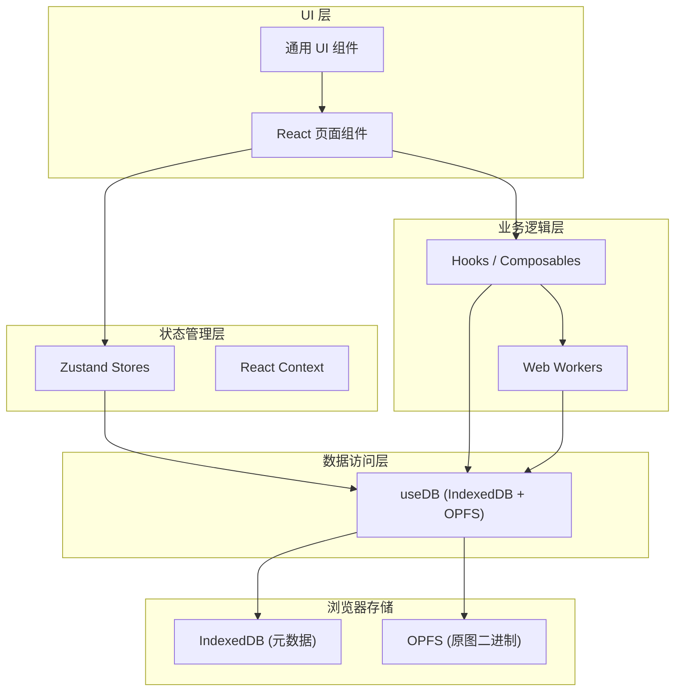

## 1. 架构设计

纯前端单页应用，无后端服务，所有数据存储在浏览器本地。数据层采用 IndexedDB + OPFS 双存储架构：元数据存 IndexedDB 支持高效查询，原图二进制存 OPFS 获得更好的大文件读写性能。业务组件通过 `useDB` 组合式函数访问数据层，不直接接触底层存储 API。



## 2. 技术描述

- **前端框架**：React 18 + TypeScript
- **构建工具**：Vite 5，默认 5173 端口
- **样式方案**：CSS Modules（按需求指定，不使用 Tailwind）
- **状态管理**：Zustand（轻量 store）+ React Context（全局 UI 状态）
- **路由**：React Router DOM
- **图标**：lucide-react
- **照片处理**：
  - exifr：读取 EXIF 元数据
  - heic2any：浏览器端 HEIC → JPEG 转码
  - face-api.js：人脸检测与特征提取（TensorFlow.js 模型）
  - 自定义 pHash：64 位感知哈希（DCT 实现）
  - 自定义 DBSCAN：人脸特征向量聚类
- **本地存储**：
  - IndexedDB（idb 库封装）：Photo/Album/Person/Tag 元数据
  - OPFS（Origin Private File System）：原图二进制文件
- **异步处理**：Web Worker（批量操作、人脸检测）

## 3. 路由定义

| 路由 | 页面组件 | 用途 |
|-------|---------|------|
| `/` | `PhotoLibrary` | 照片库（网格/瀑布流/时间线三视图切换） |
| `/albums` | `AlbumList` | 相册列表 |
| `/albums/:id` | `AlbumDetail` | 单个相册详情 |
| `/people` | `PeopleList` | 人物分组列表 |
| `/people/:id` | `PersonDetail` | 单个人物详情 |
| `/tags` | `TagManager` | 标签管理 |
| `/import` | `ImportPage` | 照片导入页面 |

## 4. 数据模型

### 4.1 ER 图

```mermaid
erDiagram
    Photo {
        string id PK "UUID"
        string fileName "文件名"
        number fileSize "文件大小(字节)"
        Date takenAt "拍摄时间(EXIF优先)"
        Date importedAt "导入时间"
        string albumId FK "所属相册ID"
        string thumbnail "256x256 base64缩略图"
        string phash "64位感知哈希"
        number width "原图宽度"
        number height "原图高度"
        string exifData "EXIF JSON序列化"
    }
    Album {
        string id PK "UUID"
        string name "相册名"
        string coverPhotoId FK "封面照片ID"
        number photoCount "照片数量"
        Date createdAt "创建时间"
    }
    Person {
        string id PK "UUID"
        string name "姓名"
        string note "备注"
        string representativePhotoId FK "代表照片ID"
        string thumbnail "缩略图 base64"
        number unnamedIndex "未命名序号(如未命名1)"
    }
    Tag {
        string id PK "UUID"
        string name "标签名"
        string parentId FK "父标签ID(嵌套)"
        string path "完整路径 如2024/旅行/日本"
    }
    Photo_Tag {
        string photoId FK "照片ID"
        string tagId FK "标签ID"
    }
    Face {
        string id PK "UUID"
        string photoId FK "照片ID"
        string personId FK "人物分组ID"
        Float32Array descriptor "128维特征向量"
        object box "人脸框坐标"
    }

    Photo }o--|| Album : "belongs to"
    Photo }o--o{ Tag : "has tags via Photo_Tag"
    Photo ||--o{ Face : "contains faces"
    Person ||--o{ Face : "groups faces"
    Tag o--o{ Tag : "nested parent"
```

### 4.2 IndexedDB Schema（idb）

```typescript
// Database name: photo-manager, version: 1
interface DBSchema {
  photos: {
    key: string; // id
    value: Photo;
    indexes: {
      byAlbum: string;      // albumId
      byTakenAt: Date;      // takenAt
      byPhash: string;      // phash
      byImportedAt: Date;   // importedAt
    };
  };
  albums: {
    key: string;
    value: Album;
  };
  people: {
    key: string;
    value: Person;
  };
  tags: {
    key: string;
    value: Tag;
    indexes: {
      byPath: string;       // path
      byParent: string;     // parentId
    };
  };
  photoTags: {
    key: [string, string];  // [photoId, tagId]
    value: { photoId: string; tagId: string };
    indexes: {
      byPhoto: string;      // photoId
      byTag: string;        // tagId
    };
  };
  faces: {
    key: string;
    value: Face;
    indexes: {
      byPhoto: string;      // photoId
      byPerson: string;     // personId
    };
  };
}
```

## 5. 目录结构

```
src/
├── components/            # 通用 UI 组件
│   ├── PhotoCard.tsx      # 照片卡片
│   ├── PhotoGrid.tsx      # 网格视图
│   ├── PhotoMasonry.tsx   # 瀑布流视图
│   ├── PhotoTimeline.tsx  # 时间线视图
│   ├── PhotoViewer.tsx    # 大图查看器
│   ├── ImportDropzone.tsx # 导入拖拽区
│   ├── ProgressBar.tsx    # 进度条
│   ├── TagTree.tsx        # 标签树
│   ├── Sidebar.tsx        # 侧边栏导航
│   ├── Toolbar.tsx        # 顶部工具栏
│   └── Modal.tsx          # 通用弹窗
├── composables/           # useDB 等数据层封装
│   └── useDB.ts           # IndexedDB + OPFS 统一封装
├── hooks/                 # 业务逻辑 hooks
│   ├── usePhotoImport.ts  # 照片导入流程
│   ├── useDuplicateCheck.ts # 查重
│   ├── useFaceDetection.ts # 人脸检测
│   └── useBatchOperations.ts # 批量操作
├── pages/                 # 页面组件
│   ├── PhotoLibrary.tsx
│   ├── AlbumList.tsx
│   ├── AlbumDetail.tsx
│   ├── PeopleList.tsx
│   ├── PersonDetail.tsx
│   ├── TagManager.tsx
│   └── ImportPage.tsx
├── store/                 # Zustand stores
│   ├── photoStore.ts
│   ├── albumStore.ts
│   ├── tagStore.ts
│   └── uiStore.ts
├── utils/                 # 工具函数
│   ├── exif.ts            # EXIF 读取封装
│   ├── thumbnail.ts       # 缩略图生成
│   ├── phash.ts           # 感知哈希算法
│   ├── heic.ts            # HEIC 转码
│   ├── dbscan.ts          # DBSCAN 聚类
│   ├── idb.ts             # IndexedDB 底层封装
│   └── opfs.ts            # OPFS 底层封装
├── workers/               # Web Workers
│   ├── batch.worker.ts    # 批量操作 worker
│   └── faceDetect.worker.ts # 人脸检测 worker
├── types/                 # TypeScript 类型定义
│   └── index.ts           # Photo/Album/Person/Tag/Face
├── styles/                # 全局样式
│   └── globals.css
├── App.tsx
├── main.tsx
└── vite-env.d.ts
```

## 6. 关键技术实现说明

### 6.1 useDB 封装
`useDB` 提供统一的 Promise 化 API，内部协调 IndexedDB 元数据和 OPFS 文件读写：
- `addPhoto(file, metadata)` → 同时写入 OPFS 文件 + IndexedDB 记录
- `getPhotoBlob(id)` → 从 OPFS 读取原图 File
- `getPhotoURL(id)` → 创建临时 blob URL 供 `` 使用
- `deletePhoto(id)` → 同时删除 OPFS 文件 + IndexedDB 记录（含关联 photoTags/faces）

### 6.2 照片导入流水线
按文件顺序异步串行处理，每步支持中断和进度回调：
1. HEIC 检测与转码（heic2any）
2. EXIF 读取（exifr，提取 DateTimeOriginal/GPS/Make/Model）
3. 缩略图生成（canvas 256x256，toDataURL JPEG quality 0.7）
4. pHash 计算（缩放到 32x32 → DCT → 取左上角 8x8 → 二值化 → 64 位十六进制字符串）
5. 查重（按 phash 查 IndexedDB，汉明距离 ≤ 5 视为重复）
6. 用户确认后写入存储

### 6.3 三种浏览视图
- **网格视图**：CSS Grid `auto-fill` + 固定 `200px` 列宽，所有卡片等宽等高 `object-cover`
- **瀑布流**：CSS `column-count` 自适应，或按列高度贪心分配照片
- **时间线**：按 `takenAt` 倒序，按 `YYYY-MM` 分组渲染，左侧绝对定位时间标记

### 6.4 大图查看器
- 使用 `requestAnimationFrame` 处理滚轮缩放（scale 0.2x - 5x）
- 键盘事件 `ArrowLeft/ArrowRight` 翻页，`Escape` 关闭
- 旋转使用 CSS `transform: rotate(90deg * n)`，旋转状态写入 Zustand 不持久化

### 6.5 人脸检测与聚类
- face-api.js 使用 `SsdMobilenetv1` 检测人脸 + `FaceRecognitionNet` 提取 128 维特征
- 所有照片处理完后运行 DBSCAN（eps=0.6，minPts=2），欧氏距离阈值判断是否同一人
- 聚类结果未命名显示为「未命名 1」「未命名 2」（unnamedIndex 自增），用户命名后 unnamedIndex 清零

### 6.6 批量操作 Worker
`batch.worker.ts` 接收 `{ type, photoIds, payload }` 消息，逐批（每 100 张）通过 `useDB` 更新数据，每批完成 `postMessage` 进度，主线程更新进度条。

### 6.7 标签嵌套与字典
- 标签用 `parentId` 自关联，`path` 字段冗余存储完整路径（如 "2024/旅行/日本"）
- 前端渲染时按 `parentId` 构建树结构，支持展开/折叠
- 重命名标签时更新所有引用该 tagId 的 Photo 关联（不改字符串，只改 tag 记录本身的 name/path）

## 7. 性能与数据量考虑

- 照片缩略图仅 256x256 JPEG（约 10-30KB），1 万张缩略图内存约 100-300MB，可接受
- 大图 lazy load，滚动到视口时才从 OPFS 读取并创建 blob URL，`useEffect` 清理时 revoke URL
- IndexedDB 查询全部使用索引，分页加载（每页 100 张）+ 虚拟滚动（可选）
- OPFS 文件操作使用 File System Access API 的同步方法（Worker 内）获得最大吞吐量
